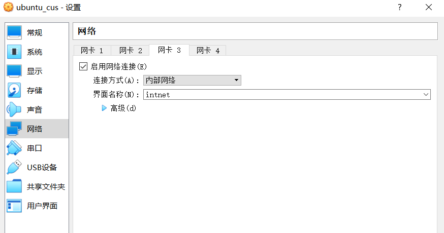
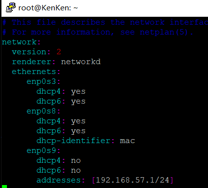

# 第六章：shell脚本编程练习进阶

## 环境


* Ubuntu 18.04 Server 64bit（工作主机：192.168.56.101）

* Ubuntu 18.04 Server 64bit（目标主机：192.168.56.102）

## 实验问题

* FTP 
  
   * 对照第6章课件中的要求选择一款合适的FTP服务器软件支持所有任务要求

* NFS 

   * 对照第6章课件中的NFS服务器配置任务

* DHCP 

   * 2台虚拟机使用Internal网络模式连接，其中一台虚拟机上配置DHCP服务，另一台服务器作为DHCP客户端，从该DHCP服务器获取网络地址配置

* Samba 

   * 对照第6章课件中smbclient一节的3点任务要求完成Samba服务器配置和客户端配置连接测试

* DNS 

   * 基于上述Internal网络模式连接的虚拟机实验环境，在DHCP服务器上配置DNS服务，使得另一台作为DNS客户端的主机可以通过该DNS服务器进行DNS查询

## 实验过程

* 配置ssh免密登录

   * 设置目标主机配置文件

      ```
      #开启ssh服务
      sudo service ssh start

      #修改配置文件/etc/ssh/sshd_config
      PasswordAuthentication yes
      PermitRootLogin yes
      AuthorizedKeysFile %h/.ssh/authorized_keys
      ```  
   
   * 配置工作主机

     ```
     #开启ssh服务
     sudo service ssh start

     #生成一对公私密钥
     ssh-keygen -t rsa -f cus

     #将公钥传输至目标主机
     ssh-copy-id -i cus.pub root@192.168.56.102 
     ``` 
   * 免密登录成功

       

* FTP :vsftpd
   
   * [vsftpd.sh](https://github.com/CUCCS/linux-2020-NewDividedc/blob/chap0x06/chap0x06/script/vsftpd.sh)
   
   * [vsftpd.conf](https://github.com/CUCCS/linux-2020-NewDividedc/blob/chap0x06/chap0x06/conf/vsftpd.conf)

   * 将文件拷贝到目标主机
   
     ```
     scp -i cus ~/workspace/chap0x06/vsftpd.sh root@192.168.56.102:~/workspace/chap0x06
     ``` 

   * 远程登录目标主机后运行脚本文件
    
     

   * 配置一个提供匿名访问的FTP服务器，匿名访问者可以访问1个目录且仅拥有该目录及其所有子目录的只读访问权限；

       
   
   * 配置一个支持用户名和密码方式访问的账号，该账号继承匿名访问者所有权限，且拥有对另1个独立目录及其子目录完整读写（包括创建目录、修改文件、删除文件等）权限；
      
      

       
   
   * FTP用户不能越权访问指定目录之外的任意其他目录和文件；
    
      

   * 匿名访问权限仅限白名单IP来源用户访问，禁止白名单IP以外的访问；
      
      * 在/etc/hosts.allow文件中添加192.168.56.101
      
      

* NFS
   
   * [nfs_ser.sh](https://github.com/CUCCS/linux-2020-NewDividedc/blob/chap0x06/chap0x06/script/nfs_ser.sh)
   
   * [nfs_cli.sh](https://github.com/CUCCS/linux-2020-NewDividedc/blob/chap0x06/chap0x06/script/nfs_cli.sh)
   
   * [exports](https://github.com/CUCCS/linux-2020-NewDividedc/blob/chap0x06/chap0x06/conf/exports)

   * 在1台Linux上配置NFS服务，另1台电脑上配置NFS客户端挂载2个权限不同的共享目录，分别对应只读访问和读写访问权限；
       
       * 将客户端脚本文件nfs_ser.sh传输到目的主机，并运行
       
          

       * 挂载的对应只读访问和读写访问权限的共享文件夹（只读：/var/nfs/gen_r；读写：/var/nfs/gen_rw）
       
          * server端
          
             

          * client端
          
              
          
          * 权限对比

              
   
   * 你通过NFS客户端在NFS共享目录中新建的目录、创建的文件的属主、权限信息

      * server端
          
         

      * client端
          
          
           
   
   * 上述共享目录中文件、子目录的属主、权限信息和在NFS服务器端上查看到的信息一样吗？无论是否一致，请给出你查到的资料是如何讲解NFS目录中的属主和属主组信息应该如何正确解读
      
      * 信息一致。默认的权限规则是，root用户被映射成nfsnobody用户，对于客户端机器上和NFS服务器上UID相同的用户会对应映射，其它非root用户被映射成nobody用户

* DHCP 
   
   * [dhcp.sh](https://github.com/CUCCS/linux-2020-NewDividedc/blob/chap0x06/chap0x06/script/dhcp.sh)
   
   * [dhcpd.conf](https://github.com/CUCCS/linux-2020-NewDividedc/blob/chap0x06/chap0x06/conf/dhcpd.conf)
   
   * [isc-dhcp-server](https://github.com/CUCCS/linux-2020-NewDividedc/blob/chap0x06/chap0x06/conf/isc-dhcp-server) 

   * 分别给服务端与客户端主机添加一块内部网卡
      
      
       
   * 服务端（192.168.56.102）
   
      * 传输脚本文件到服务端并运行
      
         

      * 运行后的客户端`/etc/netplan/01-netcfg.yaml`文件

         

      * 修改后运行情况

          

          

   * 客户端（192.168.56.101）
   
      * 修改`/etc/netplan/01-netcfg.yaml`文件
       
         ```
         #添加以下内容
         enp0s9:
         dhcp4: yes
         dhcp6: yes
         #应用
         sudo netplan apply
         ```
      * 修改后运行情况

          

* Samba
   
   * [samba.sh](https://github.com/CUCCS/linux-2020-NewDividedc/blob/chap0x06/chap0x06/script/samba.sh)
   
   * [smb.conf](https://github.com/CUCCS/linux-2020-NewDividedc/blob/chap0x06/chap0x06/conf/smb.conf)

   * 在windows 10客户端上连接Linux上的Samba服务器

      * 运行脚本文件
   
        ```
        sudo bash samba.sh
        ```
   
      * 打开资源管理器，右键“此电脑”，选择“添加一个网络位置”,输入共享文件夹路径

          

         

      * 访问匿名目录，不用输入账号密码，且不可以创建文件夹

           
   
      * 访问指定用户文件夹，需要输入账号密码，且可以创建文件夹

          

    * 在Linux上连接Windows10上的服务器
      
      * 打开控制面板，进入“网络和共享中心”，点击左侧“更改高级共享设置”,开启网络发现和文件共享，保存更改

          
      
      * 编辑要共享的文件夹D:smb_usr\，属性,点击高级共享; 勾选“共享此文件夹”，并点击权限；添加用户名，设置权限。账号密码登录共享目录`samba_usr`的用户为`kento` ，匿名登录共享目录`samba_anon`的用户为`everyone`

         

          
      
      * Linux访问Windows的匿名共享目录 (失败)

         

      * Linux访问Windows的用户名密码方式共享目录

          

      * 下载整个目录

             

* DNS
   
   * [client-head](https://github.com/CUCCS/linux-2020-NewDividedc/blob/chap0x06/chap0x06/conf/head)
   
   * [named.conf.options](https://github.com/CUCCS/linux-2020-NewDividedc/blob/chap0x06/chap0x06/conf/named.conf.options)
   
   * [named.conf.local](https://github.com/CUCCS/linux-2020-NewDividedc/blob/chap0x06/chap0x06/conf/named.conf.local)
   
   * [db.cuc.edu.cn](https://github.com/CUCCS/linux-2020-NewDividedc/blob/chap0x06/chap0x06/conf/db.cuc.edu.cn)

   * server
   
      * 安装bind
      
         ```
         sudo apt update && sudo apt install bind9
         ```

      * 修改`/etc/bind/named.conf.options`配置文件

         ```
         #添加以下内容
         listen-on { 192.168.56.102; }; 
         allow-transfer { none; }; 
         forwarders {
             8.8.8.8;
             8.8.4.4;
         };
         ```

       * 修改`/etc/bind/named.conf.local`配置文件

          ```
          #添加以下内容
          zone "cuc.edu.cn" {
              type master;
              file "/etc/bind/db.cuc.edu.cn";
          };
          ```    

       * 生成配置文件`db.cuc.edu.cn`

          ```
          sudo cp /etc/bind/db.local /etc/bind/db.cuc.edu.cn
          ``` 

       * 编辑配置文件`/bind/zones/db.cuc.edu.cn`

           

       * 重启bind9 `sudo service bind9 restart`

    * client
    
       * 安装resolvconf

          ```
          sudo apt-get update && sudo apt-get install resolvconf
          ```   

       * 修改`/etc/resolvconf/resolv.conf.d/head`配置文件

          ```
          #添加以下内容
          search cuc.edu.cn
          nameserver 192.168.56.102
          ``` 

       * `sudo resolvconf -u`   
       
    * 测试结果
    
        
       
       

## 参考文献

* [2015-linux-public-JuliBeacon](https://github.com/CUCCS/2015-linux-public-JuliBeacon/blob/exp6/实验%206/实验6.md)

* [linux-2019-luyj](https://github.com/CUCCS/linux-2019-luyj/blob/Linux_exp0x06/Linux_exp0x06/Linux_exp0x06.md)

* [How To Set Up an NFS Mount on Ubuntu 18.04](https://www.digitalocean.com/community/tutorials/how-to-set-up-an-nfs-mount-on-ubuntu-18-04)