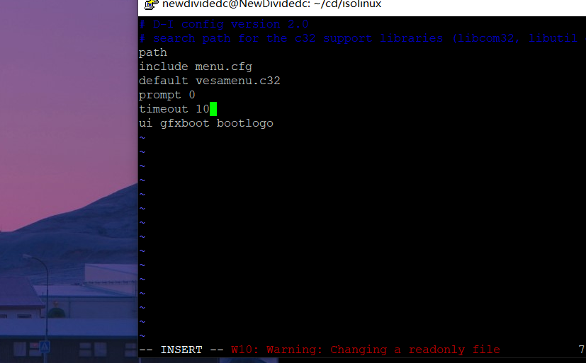
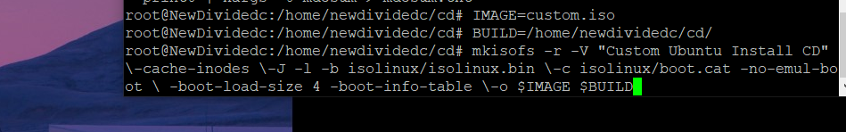

# 第一章：Linux基础（实验）
## 软件环境
##### ·Virtualbox
##### ·Ubuntu 18.04 Server 64bit 

## 实验问题
##### ·如何配置无人值守安装iso并在Virtualbox中完成自动化安装。

##### ·Virtualbox安装完Ubuntu之后新添加的网卡如何实现系统开机自动启用和自动获取IP？

##### ·如何使用sftp在虚拟机和宿主机之间传输文件？

## 实验过程

#### 1.Virtualbox安装完Ubuntu之后新添加的网卡如何实现系统开机自动启用和自动获取IP
   a.添加第二块Host-Only网卡
   
   

   b.修改\etc\netplan\01-nctcfg.yaml

  
   
  
   
  
   

   c.重新启用系统后,查看ip，网卡开启

   

#### 2.如何使用sftp在虚拟机和宿主机之间传输文件？
   a.使用putty连接虚拟机

   

   b.使用psftp连接虚拟机，并从宿主机传输ubuntu镜像文件到虚拟机

   

#### 3.如何配置无人值守安装iso并在Virtualbox中完成自动化安装

   #在当前用户目录下（/home/newdividedc）创建一个用于挂载iso镜像文件的目录

   
  
   #挂载iso镜像文件到该目录
  
   
  
   #创建一个工作目录用于克隆光盘内容并且同步光盘内容到目标工作目录
  
   
  
   
  
   #卸载iso镜像
  
   
  
   #进入目标工作目录
  
   
  
   #编辑Ubuntu安装引导界面增加一个新菜单项入口
  
   
  
   #添加以下内容到该文件后强制保存退出（而后更改为添加到文首）
  
   
  
   #从宿主机上传ubuntu-sever-autoinstall.seed到/home/newdividedc/cd/preceed
  
   
  
   #修改isolinux/isolinux.cfg，更改timeout 0为timeout 10（可选，否则需要手动按下ENTER启动安装界面） 
  
   
   
  
   #重新生成md5sum.txt
  
   
  
   #封闭改动后的目录到.iso
  
   
  
   #查看cd目录，已有生成的custom.iso，将其通过psftp传输到宿主机
  
   
   
   
  
   #自动安装过程
  
   
   
   
   
  
   #安装成功
  
   
   
   
   

## 参考资料：
 [1.老师b站补丁视频](https://www.bilibili.com/video/av95931311/?p=2&t=1326)
 
 [2.无人值守Linux安装镜像制作](https://blog.csdn.net/qq_31989521/article/details/58600426)
 
 [3.windows下用putty上传文件到远程linux服务器](https://blog.csdn.net/wuzuyu365/article/details/67640043)

## 实现特性
   定制一个普通用户名和默认密码

   
   
   定制安装OpenSSH Server
   
   安装过程禁止自动联网更新软件包
   
   
   
   参考资料：[往届师哥作业](https://github.com/CUCCS/linux/blob/master/2017-1/snRNA/ex1/无人值守Linux安装镜像制作.md)
## 实验遇到的问题及解决方法
   1.以为挂载光盘失败

   
   
   
   
   [参考资料](https://zhidao.baidu.com/question/224592291.html?qbl=relate_question_0)
   
   2.使用psftp传输镜像文件到虚拟机上时，出现“permission denied”，上传失败。使用chmod 777命令给目标文件权限以后，上传成功。
   
   
   
   [参考资料](https://blog.csdn.net/sihai12345/article/details/79370405)
   
   3.使用mkisofs命令制作镜像文件后，出现错误提示。按照提示更新安装相应软件包后成功。
   
   [参考资料](https://blog.csdn.net/qq_31989521/article/details/58600426)